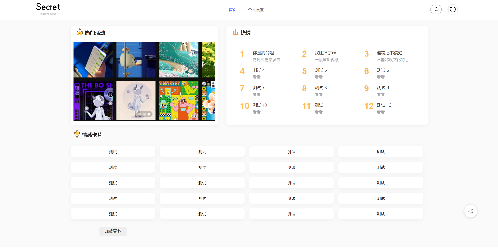
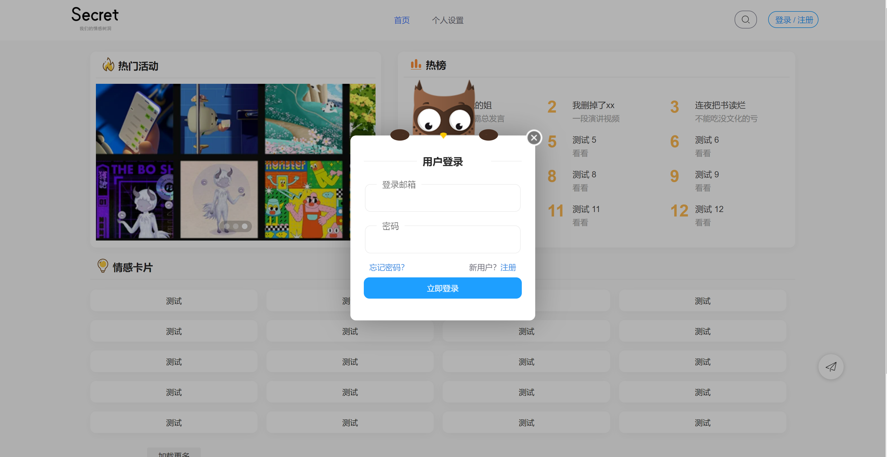
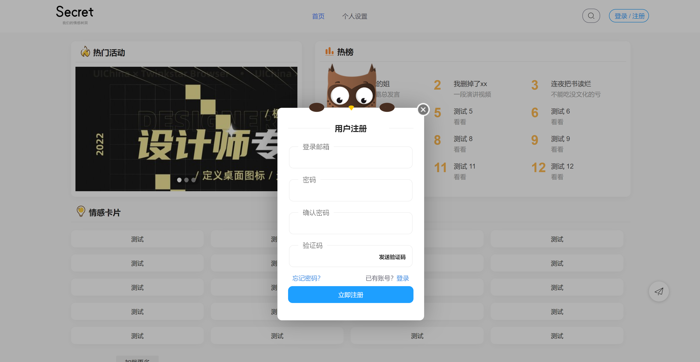
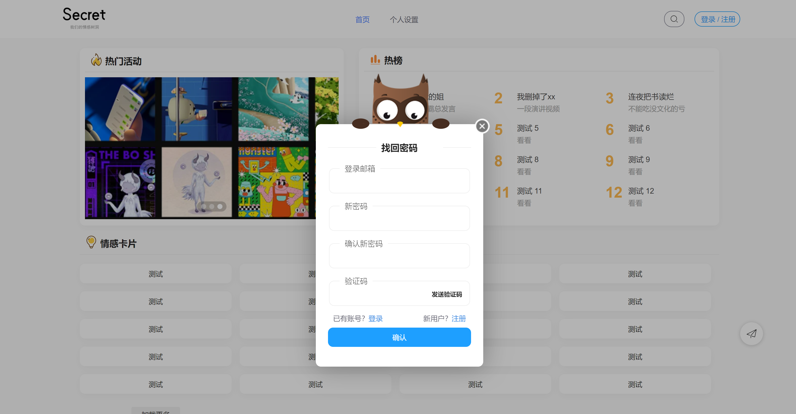
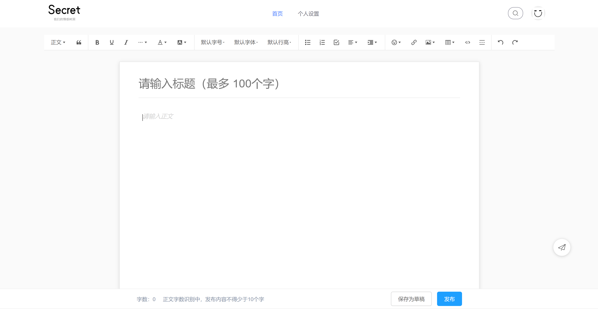
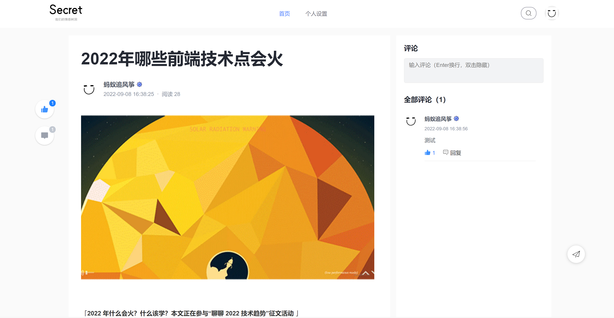
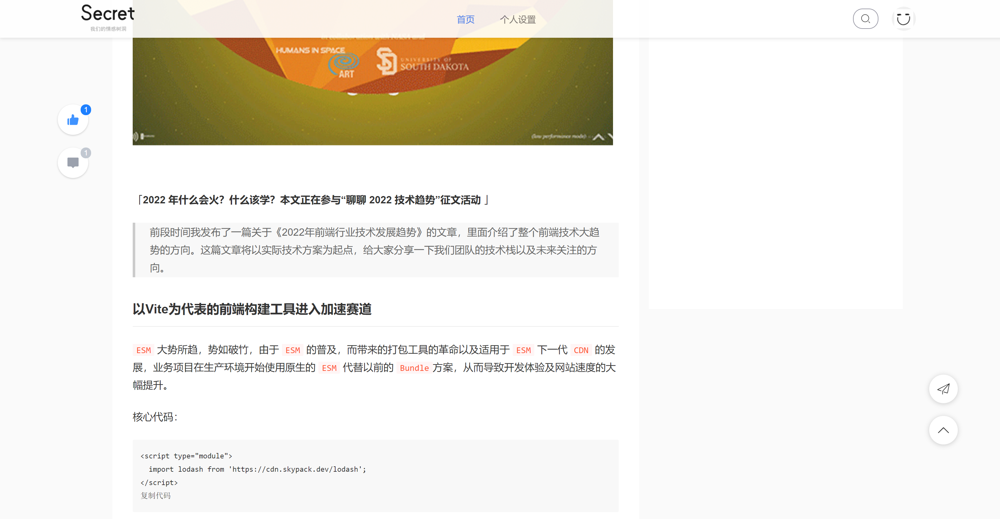
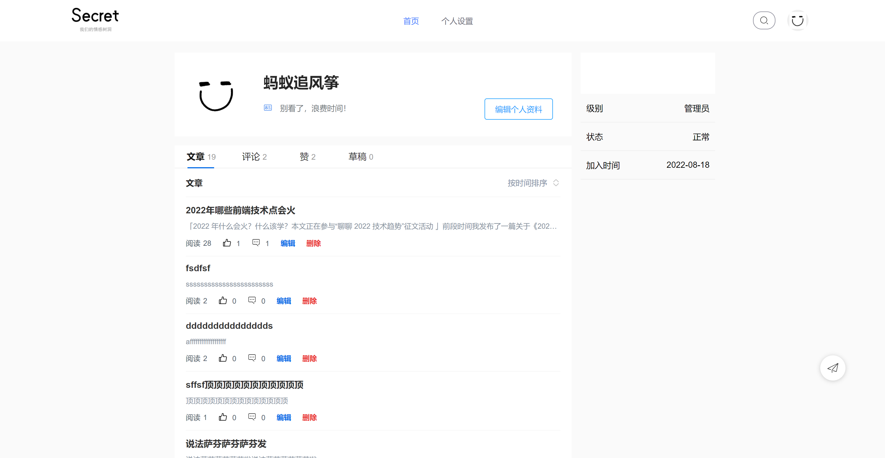
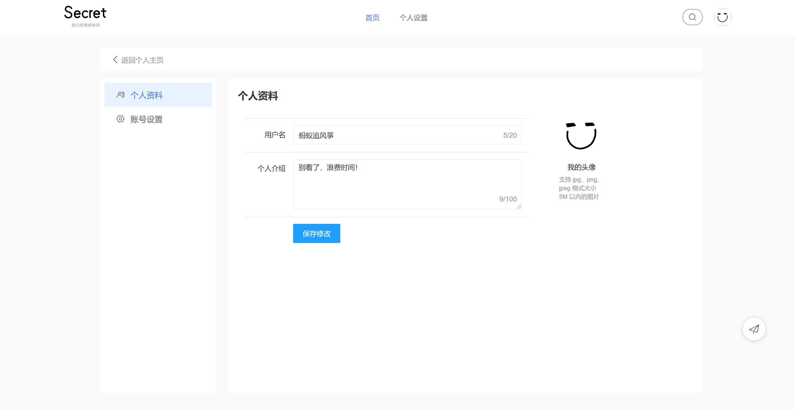

  

  一个定义不明的社区系统

## Tree-Hole-Secret
A Simple Emotional Community System  
本项目我给它命名为Secret，项目最初的目标是打造一个情感树洞类型的社区，但现在的开发有点不尽人意。

## 项目特点
* 前端采用了layui组件库，使用了jQuery及其插件
* 前端文本编辑器采用了wangeditor
* 后端主要开发语言采用了python，采用了flask框架
* 具有独立的用户系统
* 前端ui比较简洁美观，应该比较符合部分人的需求
* ...

## 缺点以及不足，待完善
* 首页的页面未进行渲染，以及首页的瀑布流功能为完善
* 社区搜索功能没完成
* 文章页面的评论回复功能没完成
* 个人主页的文章排序功能没完成，以及文章展示改为滚动加载没完成
* 个人设置页，账号设置里面的功能没完成

## 部分展示

  

